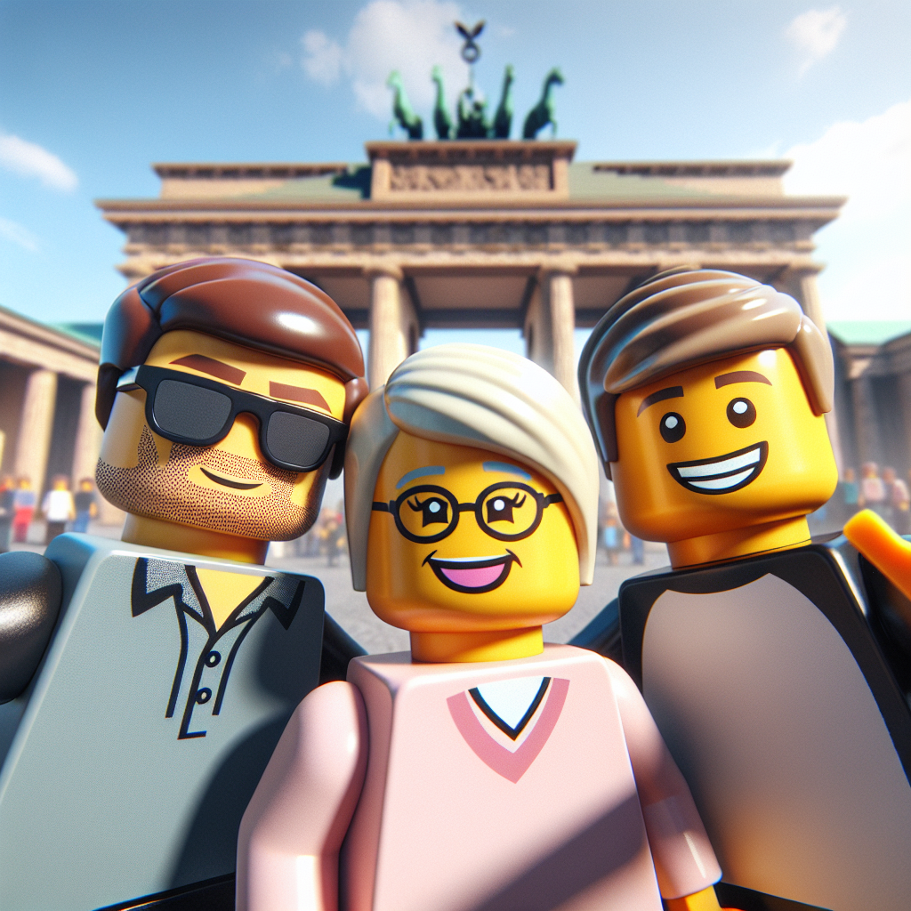
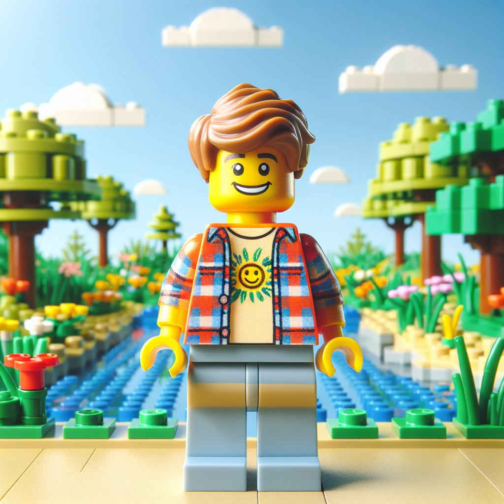

# LEGO Vision

Generate LEGO like looking images with gpt4-vision and DALL·E 3.

This uses `gpt4-vision` to generate a prompt for `DALL·E 3`.
The resulting image should be in the style of the LEGO movie.

## One example

More examples are below.



## 1. add your own API key

You need to add your own [OpenAI API key](https://beta.openai.com/docs/developer-quickstart/overview) to a `.env`-file. There is an `example.env`-file for help with naming.

The `.env`-file should look like this:

```bash
OPENAI_API_KEY="sk-xxxxxx"
```

## 2. install dependencies

```bash
npm install
```

## 3. Edit the script

You need to add the path to your image and maybe some additional info about the photo to the script.

In the `gen_image.js` file you only need to edit the `main`-function. (You can of course edit the rest of the file as you like :) )

You can use the `image_url` if the image is hosted somewhere. Otherwise use the `image_path` to define a relative path.

```javascript
  const new_image_url = await the_chain({
    image_path: './path_to_the_image.jpg',
    image_url: 'https://url.to/the_image.jpg',
    additional_info: 'The age of the person or other important info.' // leave empty if not needed
  })
```

## 4. run the script

Running the script can take a few seeconds. It will print out the prompt it send so DALL·E 3 and the final image url to download the image.

```bash
node gen_image.js
```

## Examples




